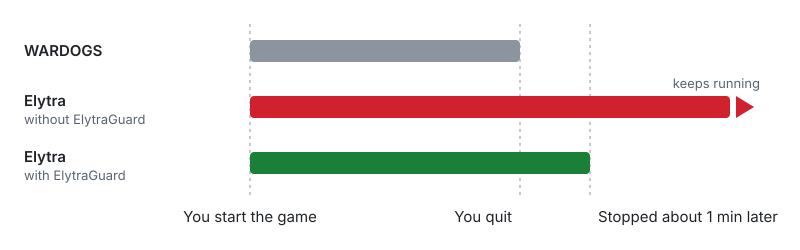
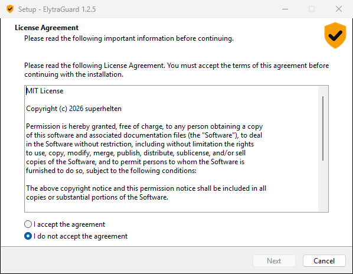

# ElytraGuard

Stops the **Elytra anti-cheat** service when **WARDOGS** is not running.
Website: <https://superhelten.github.io/elytraguard/>

In September 2026 WARDOGS replaced Easy Anti-Cheat with Elytra (by VAIIYA).
Elytra installs a Windows service, `Elytra.Service`, that runs as
LocalSystem, the most privileged account on your PC. The game starts the
service when it launches, but the service can keep running after the game
has closed. ElytraGuard stops it again once the game is gone, so the
anti-cheat only runs while you play.



It does **not** block, modify or uninstall Elytra, and it never touches game
files. The next time you start WARDOGS, the game starts the service again as
usual.

> Not affiliated with Bulkhead, Team17, VAIIYA or Embark. Use at your own
> risk. ElytraGuard only acts while the game is closed, but read the game's
> terms if you are unsure.

## Quick start

1. Download `elytraguard-setup.exe` from the
   [latest release](https://github.com/superhelten/elytraguard/releases/latest).
2. Run it and accept the admin prompt.
3. Play as usual. Less than a minute after you quit WARDOGS, Elytra is stopped.

You need Windows 10 or 11 and an administrator account. Nothing else: it
uses the PowerShell that ships with Windows.

## Install

### With the setup program

The setup program isn't code-signed, so SmartScreen may say *Windows
protected your PC*. Choose **More info**, then **Run anyway**.

To check the download before running it, paste this into PowerShell. It
compares the file with `SHA256SUMS.txt` from the release and prints `OK` or
`MISMATCH`. It catches a damaged download or a copy from somewhere else; it
can't help if the GitHub release itself were tampered with. For the zip,
change the file name on the first line.

```powershell
$file = "$HOME\Downloads\elytraguard-setup.exe"
$sums = "$env:TEMP\elytraguard-SHA256SUMS.txt"
Invoke-WebRequest https://github.com/superhelten/elytraguard/releases/latest/download/SHA256SUMS.txt -OutFile $sums -UseBasicParsing
$line = Select-String -Path $sums -SimpleMatch "  $(Split-Path $file -Leaf)" | Select-Object -First 1
if ($line -and $line.Line.Split(' ')[0] -eq (Get-FileHash $file -Algorithm SHA256).Hash) { 'OK' } else { 'MISMATCH: do not run this file' }
```

Setup only unpacks the scripts and runs the same `install.ps1` as the zip
below, so both ways end in the same state. It also adds ElytraGuard to
*Settings > Apps > Installed apps*, where you can uninstall it.



### From the zip

If you'd rather read every script before running it, download
`elytraguard.zip` from the same release, extract it, and run in PowerShell:

```powershell
cd "$HOME\Downloads\elytraguard"
powershell -ExecutionPolicy Bypass -File .\install.ps1
```

Without admin rights it asks for them through the Windows prompt and carries
on in a new window. If you have downloaded ElytraGuard before, Windows may
have extracted the new zip to `elytraguard (1)`; use that folder, or you'll
install the old version. Options: `-IntervalMinutes 5 -GraceMinutes 10`.

Either way, the installer:

- copies the guard and `status.ps1` to `C:\Program Files\ElytraGuard`.
  Normal users can't write there, which matters because the task runs as
  SYSTEM;
- creates the log folder `C:\ProgramData\ElytraGuard`. Users can read it,
  but only SYSTEM and Administrators can write to it;
- registers the `ElytraGuard` scheduled task.

## Is it working?

```powershell
& "$env:ProgramFiles\ElytraGuard\status.ps1"
```

This prints a verdict, whether Elytra is running right now, and what the
guard did recently, with identical runs merged into one line:

```
ElytraGuard: OK
  Elytra anti-cheat is stopped right now.
  Last check 1 min ago (checks run every 5 min).

What happened:
  13:41-14:31  WARDOGS open, Elytra left running (11 checks)
  14:36        WARDOGS closed, Elytra stopped by ElytraGuard 47 s later
  14:41-14:46  Nothing to do, Elytra already stopped (2 checks)

Scheduled task details need an admin prompt; that is normal.
```

It shows `NOT OK` and exits with code 1 for:

- a task that is disabled or has stopped running;
- a missing or empty log;
- warnings or errors in the log;
- Elytra still running without the game after several runs.

Run it in an admin PowerShell to see the task details too.

### Staying up to date

ElytraGuard never goes online, so it can't tell you about new versions.
To get an email when one is out, open the
[repository](https://github.com/superhelten/elytraguard), choose **Watch**,
then **Custom**, and tick **Releases**. `status.ps1` shows the version you
have. To update, run the new setup program or `install.ps1` from the new
zip; your log and the record of Elytra's setup are kept.

## Uninstall

If you used the setup program, uninstall ElytraGuard from *Settings > Apps >
Installed apps*. It asks whether to delete the log and the record of
Elytra's setup as well; a silent uninstall keeps them.

Otherwise, from the unzipped folder in PowerShell (it asks for admin rights
the same way):

```powershell
powershell -ExecutionPolicy Bypass -File .\uninstall.ps1               # keeps the log
powershell -ExecutionPolicy Bypass -File .\uninstall.ps1 -RemoveLogs   # also removes the record of Elytra's setup
```

Elytra and WARDOGS are not touched.

## FAQ

**Can this get me banned?** ElytraGuard never acts while the game is
running. It only stops the service after you have quit, and the game starts
it again on the next launch. It doesn't modify, block or hide from Elytra.
It is not affiliated with or approved by the game's makers, though, so there
is no guarantee.

**Does it send any data anywhere?** No. ElytraGuard makes no network
connections. When Elytra's program files change, it asks Windows to verify
their signature, and Windows may then download a missing certificate as it
does for any signed program.

**Why does it need administrator rights?** Setting up a task that runs as
SYSTEM takes an administrator. Running as SYSTEM lets the guard see which
programs run from the game folder, and keep its log and records where normal
programs can't change them.

**What if WARDOGS or Elytra updates?** The game is found by its install
folder, not only by process names, so renamed executables are still
recognized. Changes to Elytra itself are watched too; see
[Watching Elytra for changes](#watching-elytra-for-changes).

**Linux or Steam Deck?** No. The service it manages is a Windows service.

## How it works

`elytraguard.ps1` runs as SYSTEM at startup and every 5 minutes. On each run:

1. If Elytra isn't running, do nothing.
2. If any process from the WARDOGS install folder is running, or a process
   with a known game name (`WardogsLauncher-Shipping`,
   `WardogsClient-Win64-Shipping`), leave Elytra alone. The install folder is
   found through your Steam libraries.

   The run then waits for the game to close, without using any CPU. Once the
   game has been closed for 45 seconds, it carries on with the steps below,
   so Elytra stops less than a minute after you quit (about 45 seconds)
   instead of at the next run.
   The 45 seconds cover the switch from launcher to game client.
3. If the service started less than 10 minutes ago, or its start time can't
   be read, leave it alone, so a game that is still starting up is never cut
   off. This step is skipped after waiting for the game, since the game has
   then clearly come and gone.
4. Otherwise, stop the service.

Every run appends one JSON line to
`C:\ProgramData\ElytraGuard\elytraguard.log`, which rotates at 1 MB. A run
that is waiting for the game adds a `game_running` line every 5 minutes.

## Watching Elytra for changes

A game update can change what Elytra installs, for example by adding a
driver. ElytraGuard records how Elytra is set up and compares every run
against that record. Ordinary updates, signed by the same company
certificate as before, are simply noted. Anything else is a warning in the
log and in `status.ps1`, on every run, until you have looked at it and
accept it:

```powershell
& "$env:ProgramFiles\ElytraGuard\elytraguard.ps1" -AcceptElytraChanges
```

Without admin rights, this asks for them through the Windows prompt and
continues in a new window.

<details>
<summary>What is recorded, and what counts as a warning</summary>

The record covers:

- the service: program, start type, account, type, dependencies,
  permissions and recovery actions;
- the program files (`.exe`, `.dll`, `.sys`) in Elytra's folder, with their
  SHA-256 hash and signing certificate: its name, thumbprint and chain. A
  file only counts as signed if Windows finds the signature valid, meaning
  intact and chained to a root it trusts. The `Content` folder holds data
  packages that change all the time and is left out;
- any other service, driver or scheduled task named after Elytra or VAIIYA,
  or running a program from Elytra's folder.

An update where program files change but are validly signed with a
certificate already in the record is logged as `"footprint": "updated"`, and
the record moves along. Certificates are matched by thumbprint, not by name,
so another certificate issued to the same company name is a warning. So is a
changed service setting, an unsigned file, any driver file, a new related
service, driver or task, or Elytra's folder left behind without its service.

The record is `C:\ProgramData\ElytraGuard\elytra-baseline.json`. Like the
log, only SYSTEM and Administrators can change it, so a program running
without admin rights can't rewrite it to hide a change. Each time the guard
saves it, it also stores its SHA-256 in the registry under
`HKLM\SOFTWARE\ElytraGuard`. A record that has been deleted, edited, or has
no matching hash is a warning (`"footprint": "unverified"`), never a quiet
fresh start, until you accept Elytra's current setup. The very first record
trusts Elytra as it is at that moment, so install ElytraGuard on a PC you
trust. ElytraGuard never changes Elytra's settings or files; it only watches
them.

Not covered: a driver or service with an unrelated name, installed somewhere
else.

</details>

## Log reference

The `result` field of each log line is one of:

| result | meaning |
|---|---|
| `idle` | Elytra not running, nothing to do |
| `game_running` | the game is running, Elytra left alone |
| `grace` | Elytra started recently, left alone for now |
| `stopped` | Elytra stopped |
| `would_stop` | dry run (`-DryRun`), nothing stopped |
| `no_service` | Elytra not installed |
| `accepted` | an admin ran `-AcceptElytraChanges` |
| `error` | something failed, see `message` |

A `stopped` line after a match also has `after_game_s`: how many seconds
after the game closed Elytra was stopped. It is usually about 46, the 45
seconds of waiting plus the stop itself.

The `footprint` field is `recorded`, `same`, `updated`, `changed`,
`unverified`, `accepted` or `error`. A line with `"level": "warn"` has a
`message` saying why: a change to Elytra, or a WARDOGS install folder that
couldn't be found, in which case the guard falls back to the known process
names.

### Push alerts (optional, for Grafana Loki users)

Skip this unless you already collect logs with Grafana Loki. The lines below
are not PowerShell commands: they are LogQL queries to paste into Grafana
alert rules, with the log shipped to Loki under the label
`job="elytraguard"`. The log is JSON lines, so any log shipper can pick it
up. Together the three rules cover the ways the guard can fail silently:

```logql
# Guard not running (task disabled/deleted): alert when this is < 1, and on "no data"
sum(count_over_time({job="elytraguard"} [15m]))

# Elytra running without the game on 4+ runs in 20 min: alert when > 3
sum(count_over_time({job="elytraguard"} | json | service_state="Running" | game_running="false" [20m]))

# Guard reported a problem: alert when > 0
sum(count_over_time({job="elytraguard", level=~"warn|error"} [10m]))
```

## Development

The tests need no admin rights and run under Windows PowerShell 5.1 and
PowerShell 7:

- `tests\status.tests.ps1` checks the status output against sample logs.
- `tests\guard.tests.ps1` runs the guard with `-DryRun` against real
  services and a stand-in game process, so nothing is ever stopped. It
  refuses to run while WARDOGS is open.
- `tests\footprint.tests.ps1` checks which changes to Elytra's setup count
  as an update and which as a warning.

The setup program is built from `installer\elytraguard.iss` with
[Inno Setup](https://jrsoftware.org/isinfo.php) 6. Run
`installer\build.ps1`; it reads the version from `elytraguard.ps1` and writes
`dist\elytraguard-setup.exe`.

## License

MIT
